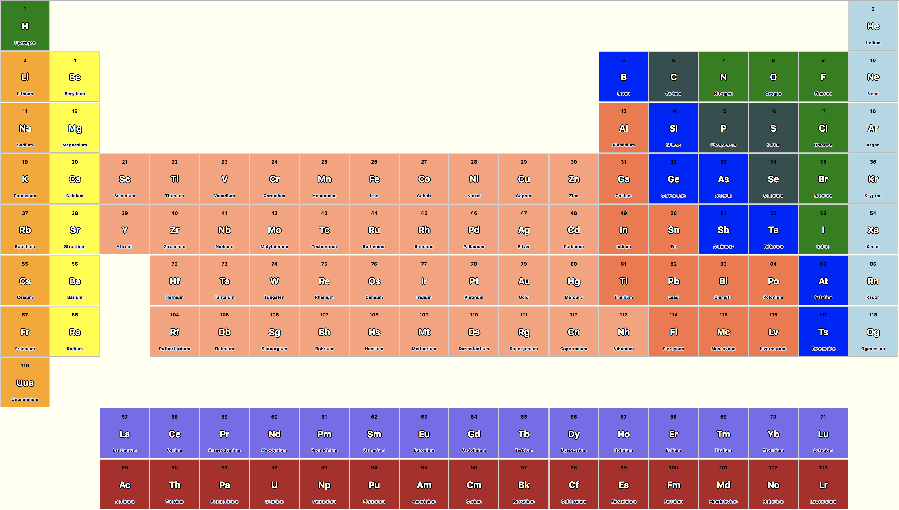

## Brief

Educational App
The BBC are looking to improve their online offering of educational content by developing some interactive apps that display information in a fun and interesting way.

Your task is to make an MVP to put forward to them - this may only be for a small set of information, and may only showcase some of the features to be included in the final app. You might use an API to bring in content or a database to store facts. The topic of the app is your choice, but here are some suggestions you could look into:

Interactive timeline, e.g. of the history of computer programming
Interactive map of a historical event - e.g. World War 1, the travels of Christopher Columbus
MVP
Display some information about a particular topic in an interesting way
Have some user interactivity using event listeners, e.g to move through different sections of content
Some samples of existing apps for inspiration:

http://chemistryset.chemheritage.org/#/
http://www.royalmailheritage.com/main.php
http://histography.io - may only work in Safari
http://worldpopulationhistory.org/map/1838/mercator/1/0/24/

# Project Title

Periodic Table of Elements

## Getting Started

Once cloned or downloaded, use npm install command in the terminal at root level and npm install at client level. Have mongod running and then use npm start at root level in one terminal and npm start at client level in another terminal. You should then be able to view the application in the browser at http://localhost:3000/

## Running the tests

In the terminal run npm test

## Built With

JavaScript, React, MongoDB, Express and Mocha

## Acknowledgments

* Periodic table API before modifications [Bowserinator](https://github.com/Bowserinator/Periodic-Table-JSON/blob/master/PeriodicTableJSON.json)
* Video Series from https://www.youtube.com/user/periodicvideos
